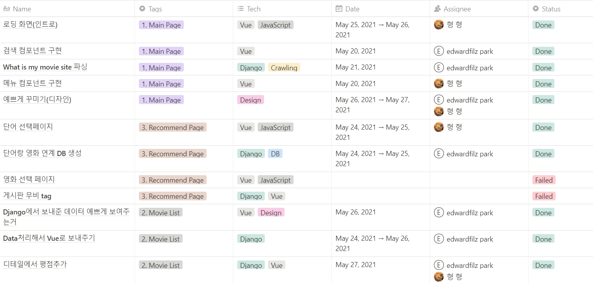
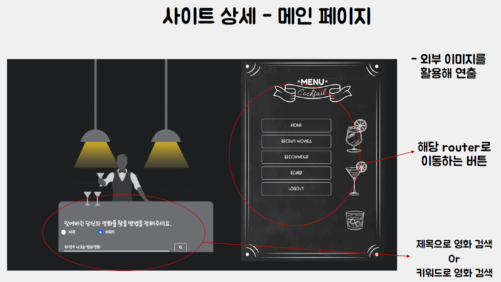
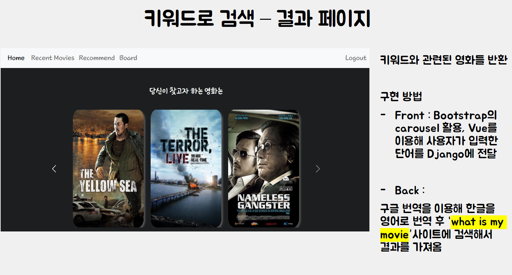
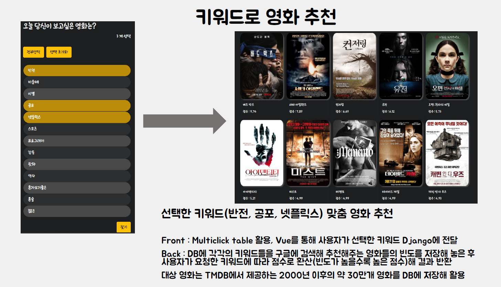
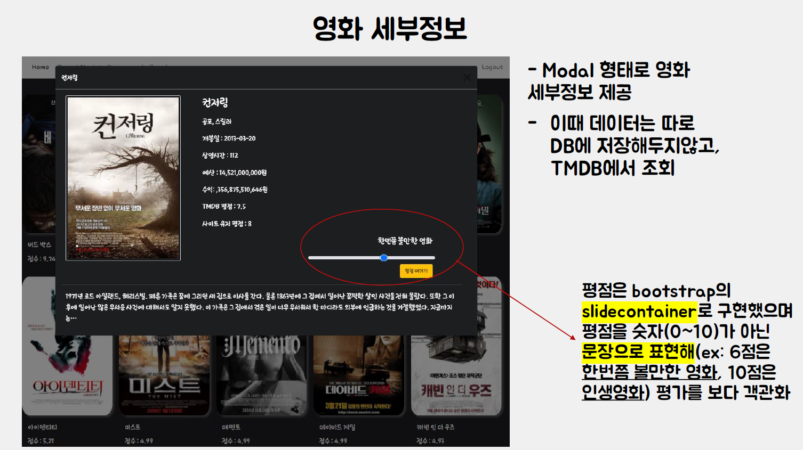
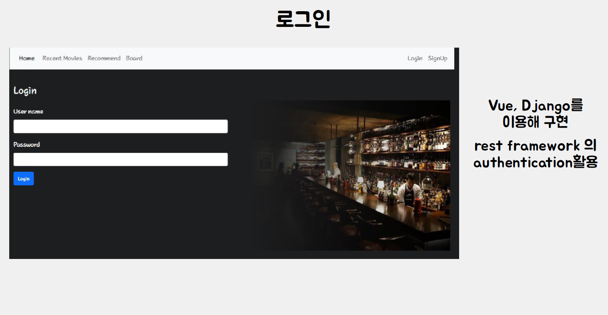
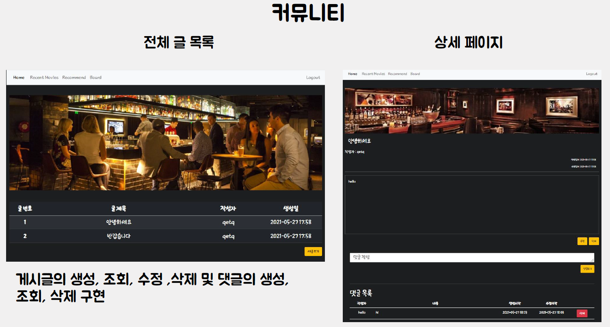

# 영화 추천사이트 구현(Back-end)

## 프로젝트 개요

키워드(단어)를 기반으로 영화를 추천해주는 사이트 구현

프로젝트 구성원 : 김지형, 박은상

## 사이트 기능 소개

### 메인 기능

- 키워드로 영화 검색 : ex) 하정우 나오는 범죄 영화 -> 범죄와의 전쟁 등

- 키워드로 영화 추천 : ex) 반전 + 넷플릭스 + 공포 -> 셔터아일랜드 등

  

### 부가 기능

- 영화 커뮤니티(게시판) + 댓글

- 로그인

- 개봉예정 영화 목록

- 사용자 평점 등록

  

## 개발 환경

- 언어 : Python, JavaScript

- 프레임워크 : Django, Vue.js

- 도구 : VsCode

- 데이터 출처 : TMDB, Google

  

## 역할 분담 / 일정 관리

Notion을 이용해 구현해야할 것들을 세부적으로 나눈 후 일정을 정하고, 담당자를 정해 진행

### 역할 분담

김지형 : 게시판, 로그인, 디자인, 전반적인 Front-end

박은상 : 데이터 수집, 영화 추천, 전반적인 Back-end

## 사이트 상세

`

## 배포

사이트 : http://movie-recommend-bigdata.s3-website.ap-northeast-2.amazonaws.com/

Front-end 서버는 AWS S3, Back-end 서버는 AWS Lightsail사용.

### 한계점

Django server 의 성능이 좋지 않아 많은 DB 를 업로드 하는데 한계가 있었음 차차 DB 를 채워 나갈 예정
